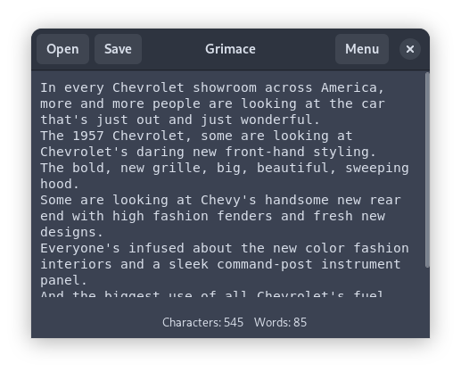

# grimace

## *a facial expression usually of disgust, disapproval, or pain*

grimace is an experimental gtk program that transcribes stuff with the whisper AI model. 

### building

build with `nix run` and use `nix develop` to invoke a development shell. 

### known issues

- [ ] cancelling on open/save functionality panics (i can fix this)
- [x] ~~model is re-downloaded with every invocation~~
- [ ] settings menu doesn't work

